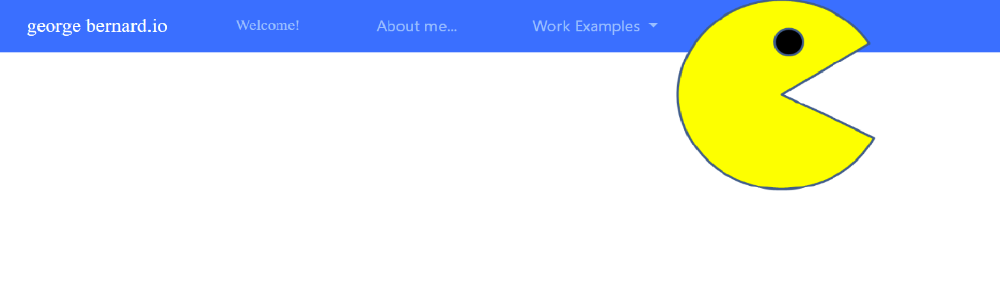
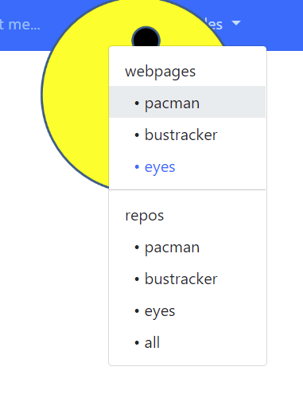

# pacman

##animates pacman's mouth and movement, when he reaches a boundary he changes direction randomly and continues at the same speed
##Js used to animate html image
##works well with page changes
##Check it out[https://georgebernard4.github.io/pacman/]
##the program already recognizes which boundary pacman is hitting, his acceleration is set to 0,
##in the future I would like to have user inputs to add wind or gravity, and modify what pacman does when he hits a boundary
##files needed to render page, pacman.css, index.html, pacman.js, images with PacMan1.png - PacMan4.png
##pacman walks over the navbar, yet under the dropdown menu
##